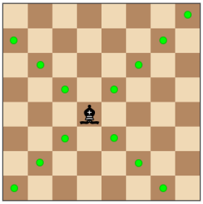
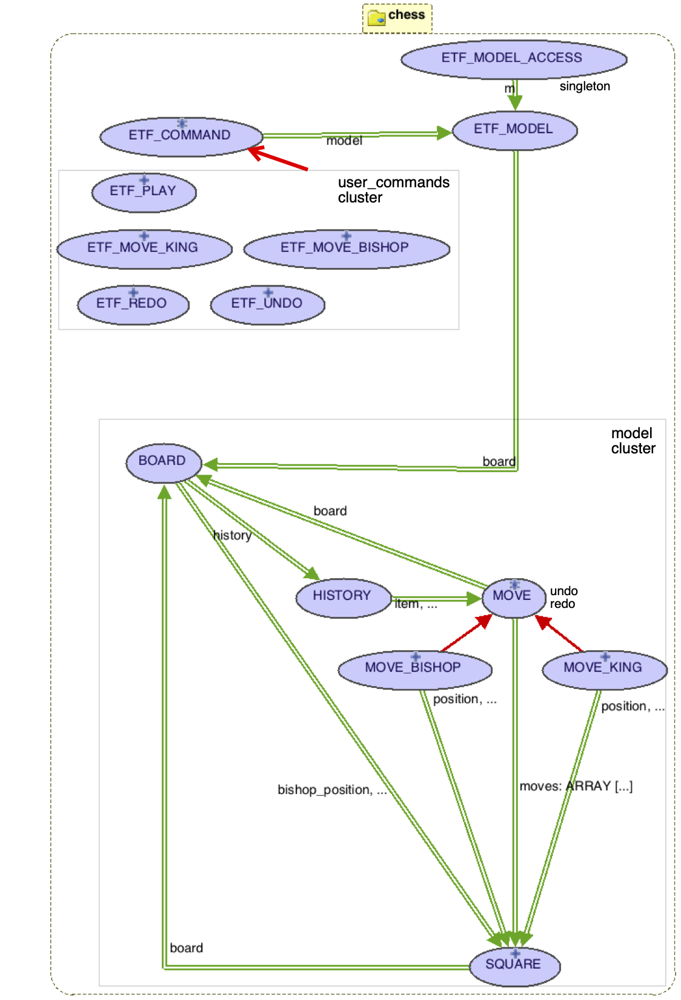
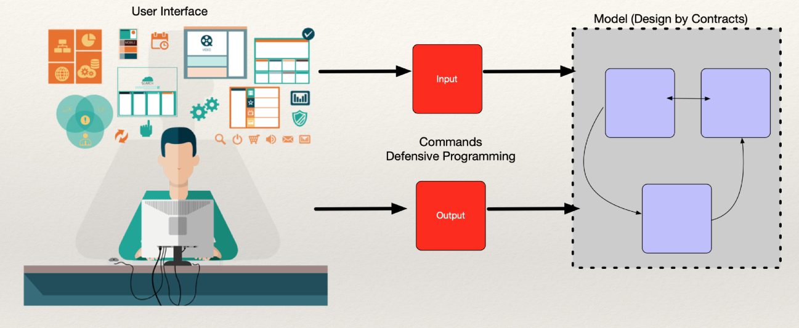
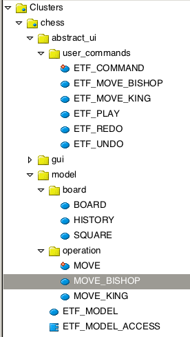

# Chess challenge (undo/redo design pattern)


## Labtest Prep
This is preparation that you must do for Labtest2.

## Introduction and Principles

Chapter 21 of OOSC2 (see SVN readings) discusses a general **undo/redo design pattern**. Using ETF for the user interface, you must **design** a chessboard that supports the moves of various pieces, and the ability to undo/redo moves efficiently. See the BON class diagrams in the OOSC2 chapter for the architecture of this pattern. 

See folder `src` for some program text to help you with your design.  In the Labtest you will apply the undo/redo design pattern for a chess board with only two pieces, e.g. a king (K) and a bishop (B). The undo/redo design pattern is built on top of basic OO constructs such as static typing, dynamic binding and polymorphism. We also provide an acceptance test to check the feasibility and correctness of your design. You will want to write many of you own during your prep. 

You will need to be competent in the use of the IDE with ETF (as in all the lab exercises until now). 

In job interviews with companies, students are often asked questions involving the movements of pieces in games such as kings, bishops or other game pieces. So think of this as a job interview question. 

In a Labtest, to keep it simple and time-limited, we might provide you with an ETF starter project and ask you to design a game with different pieces taken from kings, bishops, rooks, and knights. In the `docs` folder see `chess_moves.e` as well as the UI grammar. 
  
`directions_of_player (player: CHARACTER): ARRAY[TUPLE[x: INTEGER; y: 
  INTEGER]]`
  
The pieces move around on the board but do not "capture" each other but unlike normal chess they can jump over each other. A piece cannot move into an occupied square. 

* The king moves exactly one square horizontally, vertically, or diagonally.
*  A rook moves any number of vacant squares in a horizontal or vertical direction. 
*  A knight moves two squares horizontally then one square vertically, or moves one square horizontally then two squares vertically—i.e. in an "L" pattern.
*  A bishop moves any number of vacant squares in any diagonal direction.



Ensure that you understand how these pieces move. The abstract algorithm (template design pattern) for any piece is in class MOVE (see `src` folder). Individual pieces must implement the relevant concrete moves so as to make use of static typing, dynamic binding and polymorphism.

Please read and understand the design/code and ensure that you get it working correctly to specification. 

## Undo/redo design pattern

In this exercise, the focus is on the undo/redo design pattern, not the contracts (although you may find the use of preconditions in the business logic useful in debugging of your design). You do defensive programming at the user interface (ETF_COMMAND) due to the need for tolerant preconditions, but messages are kept simple to keep the challenge limited. In the business logic, the preconditions are stronger to ensure the safety of the game with respect to the rules of chess moves, and thus there is much less need for defensive programming. 

The redo/undo design pattern is discussed in OOSC2 chapter 21, with the following goals:

 * The mechanism should be applicable to a wide class of interactive applications, regardless of the application domain.
 * The mechanism should not require redesign for each new input command.
 * **It should make reasonable use of storage**. (E.g. in this example, you must not store a history of moves where each move is stored with the whole board accompanied by the location of all the pieces. You must store just **minimal** information needed to undo or redo a specific move. Note that in this example the history is unbounded and thus efficient storage is essential). 
 * It should be applicable to arbitrary-levels of undo/redo.

 
## Design of the Model Cluster

Below is the start of a possible design where we use the IDE BON diagramming tool. 



The design follows the basic **UI-View/Model pattern** in which commands at the user interface are handled using a **command design pattern** (no preconditions as the user may try to make an illegal move so our design must handle all syntactically correct inputs in a **tolerant** fashion). These user commands depend on the model operations such as MOVE\_KING or MOVE\_BISHOP (which may have **demanding** preconditions as they are only invoked for meaningful semantic moves). The user commands depend upon the model classes, but **not** vice versa. 



Classes in the model cluster can always access the board and it's dependents (such as class HISTORY etc.) via the singleton design pattern. 

The classes can be organized in relevant sub-clusters as shown below. 



In the starter project, the king moves on the board but not the bishop to give you some idea of the basic design. The deferred class MOVE* has a template pattern for moving different pieces on the board and also specifies deferred routines for undo and redo. Different pieces effect `directions` differently, to make use of polymorphism and dynamic binding. 

You will need to edit at least the following:

* BOARD
* MOVE_BISHOP
* MOVE_KING
* ETF_MOVE\_BISHOP

Some of the infrastructure is provided, so that you can focus on the undo/redo design. An Oracle is not provided as the rules are precisely specified. 

There is at least one error in the code we provide, but you should easily be able to see where this is. 

## What you must do

Start by getting the acceptance test below working. Then write you own syntactically correct acceptance tests and ensure that the project (a) compiles and (b) is correct in all respects and (c) never crashes with exceptions, or non-termination. 

**Hint**: You may wish to use the IDE to automatically generate the BON class diagram (or UML if you prefer). This diagram will assist you in understanding the architecture of the system,

**Remark**: Although this design is feasible and can be made correct, it might still be improved taking into account design principles such as abstraction, modularity and information hiding. 

## The abstract grammar at the user interface

```
system chess
  -- just a King (K) and a Bishop (B) with undo/redo

type SIZE = 5..8
  -- size of board, e.g. 5 x 5

type SQUARE = TUPLE [x: 1..8; y: 1..8]

play(size: SIZE)
  -- create a board with `size` rows and `size` columns
  -- initially, the King is always at the top left [1,1] 
  -- and the Bishop is always at the bottom right [size, size]

 move_king(square: SQUARE)
   -- some moves not permitted
   -- either due to board size
   -- or because a square is occupied

 move_bishop(square: SQUARE)
   -- some moves not permitted
   -- either due to board size
   -- or because a square is occupied

 undo

 redo
```

## An example acceptance test

```
  ok, K = King and B = Bishop:
->play(5)
  ok:
  K____
  _____
  _____
  _____
  ____B
->play(8)
  game already started:
->move_bishop([4, 3])
  invalid move:
->move_bishop([1, 1])
  invalid move:
->move_bishop([2, 2])
  ok:
  K____
  _B___
  _____
  _____
  _____
->move_bishop([3, 1])
  ok:
  K____
  _____
  B____
  _____
  _____
->move_king([1, 8])
  invalid move:
->move_king([2, 2])
  ok:
  _____
  _K___
  B____
  _____
  _____
->move_king([3, 1])
  invalid move:
->move_king([3, 2])
  ok:
  _____
  _____
  BK___
  _____
  _____
->undo
  ok:
  _____
  _K___
  B____
  _____
  _____
->undo
  ok:
  K____
  _____
  B____
  _____
  _____
->undo
  ok:
  K____
  _B___
  _____
  _____
  _____
->undo
  ok:
  K____
  _____
  _____
  _____
  ____B
->undo
  no more to undo:
->redo
  ok:
  K____
  _B___
  _____
  _____
  _____
->redo
  ok:
  K____
  _____
  B____
  _____
  _____
->redo
  ok:
  _____
  _K___
  B____
  _____
  _____
->redo
  ok:
  _____
  _____
  BK___
  _____
  _____
->redo
  nothing to redo:
```


 