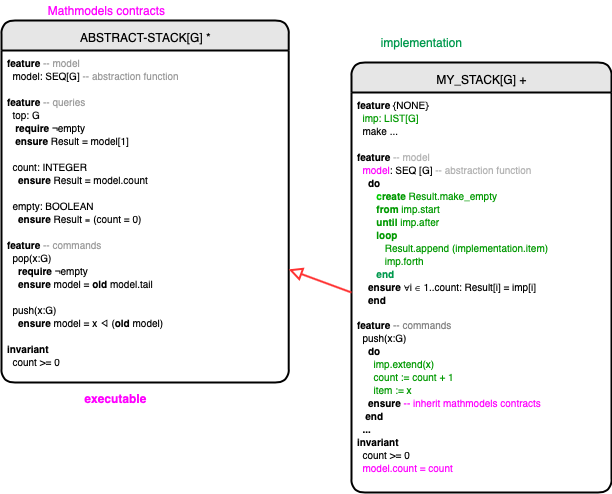

# slides-06: Mathmodels STACK[G]

This is the simplest example of using Mathmodels to specify a general stack Abstract Data Type (from OOSC2). 

Below, we use the standard notation of *push*, *pop* and *top*. 

## ABSTRACT_STACK[G]

* Infinite stack API, fully contracted using a Mathmodels representation as SEQ[G].
* Value semantics, and generic parameter **attached**. 
* This stack is both a general **Specification** of a stack -- and **executable** (so it can be tested for specification errors). For example, we can check the computational equivalent of *pop(push(stack,x)) = stack*. 
* Once we have determined by run-time assertion checking that the specification is correct, we can refine it (via inheritance) to various efficient implementations, that must all **satisfy** the Specification. 

## Efficient MY_STACK[G] implementation

* Inherits from ABSTRACT_STACK[G], which can be implemented using efficient data strctures e.g. as a linked list or array. This one is implemented with a linked list. 
* Inherits complete Mathmodels contracts (no need to change the spec)
* Only the abstraction function must be constructed. 
* Top of the stack is first element of list: model[1] ~ implementation[1]

