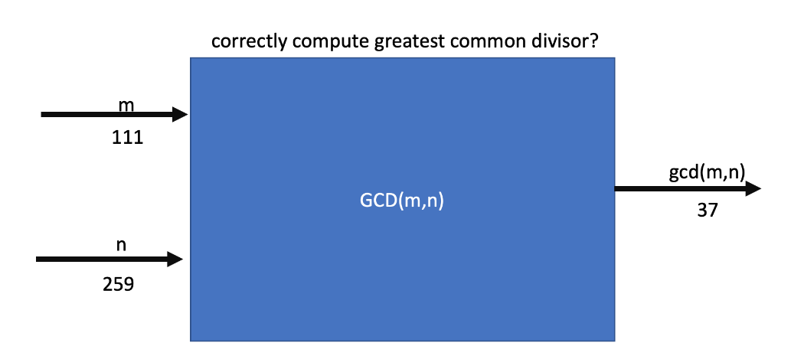

# Verification of Euclid's algorithm for GCD(m,n)

Fom Wikipedia: In mathematics, the Euclidean algorithm is an efficient method for computing the greatest common divisor (GCD) of two integers, the largest number that divides them both without a remainder. It is named after the ancient Greek mathematician Euclid, who first described it in his Elements (c. 300 BC). It is used in cryptographic computations to ensure the security of a variety of systems. 

> Cybersecurity is everyone’s problem. The target may be the electric grid, government systems storing sensitive personnel data, intellectual property in the defense industrial base, or banks and the financial system. Adversaries range from small-time criminals to nation states and other determined opponents who will explore an ingenious range of attack strategies. And the damage may be tallied in dollars, in strategic advantage, or in human lives. Systematic, secure system design is urgently needed, and we believe that rigorous formal methods are essential for substantial improvements.
> 
Formal methods enable reasoning from logical or **mathematical specifications** of the behaviors of computing devices or processes; they offer rigorous proofs that all system behaviors meet some desirable property. They are crucial for security goals, because they can show that no attack strategy in a class of strategies will cause a system to misbehave. Without requiring piecemeal enumeration, they rule out a range of attacks. They offer other benefits too: Formal specifications tell an implementer unambiguously what to produce, and they tell the subsequent user or integrator of a component what to rely on it to do. Since many vulnerabilities arise from misunderstandings and mismatches as components are integrated, the payoff from rigorous interface specifications is large. [**Report on the NSF Workshop on Formal Methods for Security**, 2016, https://arxiv.org/pdf/1608.00678.pdf]




## Computing the GCD

A C program to compute the GCD might look as follows

```c
#include <stdio.h>
int main()
{
    int n1, n2;
    
    printf("Enter two positive integers: ");
    scanf("%d %d",&n1,&n2);

    while(n1!=n2)
    {
        if(n1 > n2)
            n1 -= n2;
        else
            n2 -= n1;
    }
    printf("GCD = %d",n1);

    return 0;
}
```

It is better to wrap the algorithm in a sub-routine. In Java, sub-routines are called methods; it might look as follows:

```java
import java.util.Scanner;
public class Euclid {
	public static int gcd(int x, int y) {
		if (x == 0 || y == 0) {
			return 1;
		}
		if (x < y) {
			int t = x;
			x = y;
			y = t;
		}
		if (x % y == 0) {
			return y;
		} else {
			return euclid(y, x % y);
		}
	}

	public static void main(String[] args) {
		System.out.println("result: " + gcd(48, 24));
		System.out.println("result: " + gcd(125463, 9658));
	}
}
```

## Question: But, can we demonstrate correctness?

Well we can test the `gcd(m,n)` method. For example, we can provide inputs `m := 111` and `n := 259`, and then we can check if the output is `gcd(111,259) = 37`. 

If there is an error in the code, then we can fix it. But the problem is:

> Dijkstra: testing can show the presence of bugs, but not their absence. 

* It does not matter how many tests we run, we can never exhaustively check the correctness of the algorithm. 
* To write a test, we also need to (manually?) compute the answer, a time consuming process.

> Formal methods are the **only** reliable way to achieve security and privacy in computer systems. Formal methods, by modeling computer systems and adversaries, can prove that a system is immune to entire classes of attacks (provided the assumptions of the models are satisfied). By ruling out entire classes of potential attacks, formal methods offer an alterna- tive to the “cat and mouse” game between adversaries and defenders of computer systems.
> 
Formal methods can have this effect because they apply a scientific method. They provide scientific foundations in the form of precise adversary and system models, and derive cogent conclusions about the possible behaviors of the system as the adversary interacts with it. This is a central aspect of providing a science of security. [Report on the NSF Workshop on Formal Methods for Security, 2016].

For a formal proof Euclid's algorithm in TLA+, see [Lamport, 2011](docs/eclid.pdf)

## Design by Contract (DbC): Specifications vs. Implementations

An alternative formal method is the use of Design by Contract as exemplified in Eiffel and Ada. This method scales up to large systems, as it is compositional. 

In Eiffel, the contract view (i.e. the **specification**) of gcd(m, n) is: 

```eiffel

	gcd (m, n: INTEGER): INTEGER
			-- return the gcd of `m` and `n`
		require
			non_zero: m >= 1 and n >= 1
		ensure -- Result = max(divisors(m) ∩ divisors(n))
			gcd_spec: Result = max (divisors (m) |/\| divisors (n))
```
where `divisors(q) = {d ∈ 1..q | is_divisible (q, d)}`. In Eiffel, set comprehension is supported by our **Mathmodels** library. 

The **implementation** of the algorithm is correct if it can be shown to satisfy the specification. 

To use the GCD query, a client is obligated to satisfy the precondition. The benefit to the client, is that it is places the obligation on the supplier to ensure that the algorithm terminates, and terminates with the correct result (the postcondition).

The supplier has the benefit of the precondition; the code need not be polluted with defensive programming, keeping the code base small and readable. 

If there is a precondition violation, then that is the fault of the client. If there is a postcondition or invariant violation, then that is fault of the supplier. There is thus a contract between the client and the supplier, with benefits and obligations on each. 

## Demonstrating the correctness

```eiffel
gcd(m, n: INTEGER): INTEGER
			-- return the gcd of `m` and `n`
		require
			non_zero:
				m >= 1 and n >= 1
		local
			x, y: INTEGER
		do
			from
				x := m
				y := n
			invariant -- gcd_spec(x,y) = max(divisors(x) ∩ divisors(y))
				gcd_spec(x,y) = gcd_spec(m,n)
			until
				x = y
			loop
				if x < y then
					y := y - x
				else -- y < x
					check y < x end
					x := x - y
				end
			variant x + y
			end
			check x = y and x = gcd_spec(m,n) end
			Result := x
		ensure
			gcd_spec: -- Result = max(divisors(m) ∩ divisors(n))
				Result = max(divisors(m) |/\| divisors(n))
		end
```

There are standard proof methods which are used to verify the algorithm using the loop **variant** and **invariant**.

## Specification tests carry over to other languages


