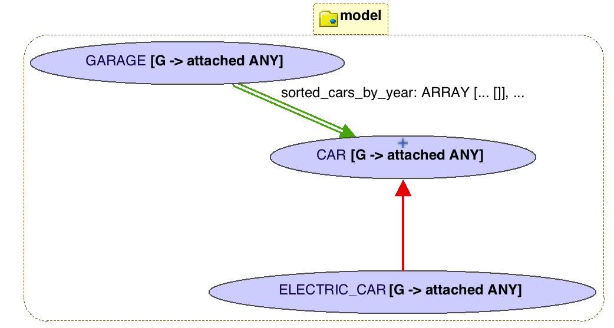

# Design of a Garage

[Youtube Playlist Garage Videos](https://www.youtube.com/playlist?list=PL5dxAmCmjv_5YwR86D1JGRDvintJYDXFM) (View in HD)

## Design Goals

We have various customers who run a showroom for new and old cars. 

1. Allow new cars to be added to the system
2. Cars have properties such as year, make and model, and mileage, etc.
3. Each customer has a different way of representing the car make and model (e.g. just a string such as "Honda CVR", or maybe with more properties such as engine type, body style, trim level etc.
4. There are specialized kinds of cars e.g. electric cars which need batteries and other mechanisms
5. Support searching for cars in different ways e.g. by car year, car id etc
6. Ensure the correctness and consistency of the data at all times
7. Ensure that the design is organized in a coherent. modular and maintainable fashion
8. Uniformly iterate over the collection of cars in the garage (e.g. at stock taking time for balance sheet and taxes)

### Designing the system to satisfy the goals

We will design this system incrementally. For organized modularity, we might start with a UML style diagram to outline the system **architecture**, or in our case a BON class diagram using the EiffelStudio IDE with 3 classes: `CAR[G]`, `GARAGE[G]`, and `ELECTRIC_CAR[G]` where `G` is a generic parameter for abstracting the make and model as per #3:

We will constantly need to use all the design principles at the URL [ Fig1: Principles](http://seldoc.eecs.yorku.ca/doku.php/eiffel/why#design_principles_covered_in_the_course).

We will want to continually switch seamlessly between **Design** and **Implementation** (i.e. construction), and we will continally wish to check that the design is feasible and correct. 

## garage-1

* **Modularity**: The system is decomposed into classes (modules) with well-specified interfaces, each class having a well-defined responsibility (e.g., the `CAR` class represents a car). See #7. 
* **Abstraction**: The type of make and `model` of a `CAR` is parameterized as a generic type (`CAR[G]`), where clients may instantiate the formal type `G` by the appropriate actual types (e.g., `STRING`, `ENGINE`). See #3. 
* **Design by Contract**: The `CAR` class is specified with an invariant `valid_mileage: odometer >= 0`. The `make` constructor's precondition will need to be strong enough to ensure that its implementation establishes this invariant. See #6.
* **Specification vs. Implementation**: Routine implementation is specified with its pre-condition and post-condition. At runtime, the implementation is checked against its specification (including class invariants). See #6, for design feasibility and correctness. 

## garage-2

* **Design by Contract**: 
	+ Runtime violation occurs when executing the `update_odometer` routine due to a faulty implementation w.r.t. its postcondition `odometer = old odometer + a_mileage`. 
	+ After fixing the fault, another line of faulty implementation is added, but it bypasses the postcondition (indicating that the specification is incomplete); after adding another postcondition (`year = old year`), a postcondition occurs as expected for this faulty implementation.

## garage-3

* **Inheritance**: A child class `ELECTRIC_CAR` is created, representing a specified kind of `CAR`. The `ELECTRIC_CAR` class reuses code defined in the `CAR` class. To ensure that a `CAR` is _substitutable_ by an `ELECTRIC_CAR`, the `ELECTRIC_CAR` class also accumulates contracts specified in the `CAR` class (class invariant and routine pre-/post-conditions).
* **IDE Support**: A BON diagram can be automatically generated in the Eiffel Studio showing the inheritance relation. _Round-trip engineering_ is supported: changes on code can be reflected on the generated diagram upon re-compilation, and vice versa. 
* **Polymorphism**: A variable with static type `CAR` (`car: CAR`) can be attached to dynamic objects whose types are descendants of `CAR` (i.e., `CAR` and `ELECTRIC_CAR`). 
* **Dynamic Binding**: The effect of a feature call (e.g., `car.update_odometer`) depends on the dynamic type of the context object.

## garage-4

* **Modularity**: The system is decomposed into classes with well-specified interface, each of which responsible for a well-defined purpose (e.g., the `GARAGE` class represents a garage with parked cars).
* **Client-Supplier Relation**: The client class `GARAGE` maintains a set of clients of type `CAR` (`cars: SET[CAR[G]]`). Service of `CAR` may be invoked on each car parked in the garage (e.g., `across cars is c loop c.update_odometer(20) end`)
* **IDE Support**: A BON diagram can be automatically generated in the Eiffel Studio showing the client-supplier relation. _Round-trip engineering_ is supported: changes on code can be reflected on the generated diagram upon re-compilation, and vice versa.
* **Uniform Access Principle**: Query `sorted_cars` can be accessed by clients uniformed via `garage.sorted_cars`, whereas the supplier may implement `sorted_cars` either as an attribute or as a routine.
* **Loop Invariant**: Query `search_car` is implemented efficiently by an iterative binary search, specified with a loop invariant (for ensuring correctness) and a loop variant (for ensuring termination). Such specification is amendable to formal proofs of program correctness. 
* **Information Hiding**: Query `sorted_cars` returns an array of cars sorted by their year of release. Given that the sorting criterion is subject to change, we hide/encapsulate it in its own module `CAR_COMPARATOR` (which is a child class of the library class `KL_COMPARATOR`). 
* **Code to the Interface, Not to the Implementation**: A variable should be declared with its static type using the interface/deferred type `KL_COMPARATOR` (e.g., `l_comparator: KL_COMPARATOR`). This makes it convenient to switch between the sorting criterion dynamically, by changing the dynamic type of `l_comparator` from one descendant class of `KL_COMPARATOR` to another. 
* **Polymorphic Collection**: The query `cars: SET[CAR[G]]` maintains a collection of objects whose static types are `CAR`, whereas dynamically each member of the collection may be attached to an object whose type is any of the descendants of `CAR` (i.e., `CAR` and `ELECTRIC_CAR`).

## garage-5

* The Iterator design pattern is applied in order to allow clients of the `GARAGE` class to uniformly access its collection of cars in a linear fashion (without concerning about the underlying implementation of the collection), e.g., `across g is car loop ... end`.

